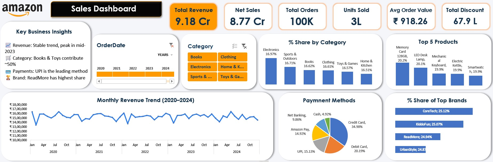

##### Amazon Sales Analysis (SQL + Excel)

##### 

##### \# **Objective**

##### 

##### Analyze Amazon sales data to understand business performance, customer behavior, and revenue trends using SQL \& Excel.

##### 

##### \---

##### 

##### \## **Tools Used**

##### 

##### \* PostgreSQL (Data Analysis)

##### \* Microsoft Excel (Dashboard \& Visualization)

##### 

##### \---

##### 

##### \## **Project Overview**

##### 

##### This project focuses on exploring and analyzing sales data to answer key business questions and generate useful insights.

##### 

##### \---

##### 

##### \## **Key Business Questions**

##### 

##### \* What is total revenue, orders, and units sold?

##### \* Which category generates the most revenue?

##### \* Which products generate highest revenue?

##### \* Which brands dominate sales?

##### \* How does revenue change over time?

##### \* Which payment method is most used?

##### \* Which category performs best each year?

##### 

##### \---

##### 

##### \## **Key Insights**

##### 

##### • Total revenue reached ₹9.18 Cr across 100K orders, indicating strong business 

##### performance.

##### • Sales are evenly distributed across categories (\~16–17%), showing no heavy dependency 

##### on a single category.

##### • CoreTech and KiddoFun are the leading brands driving maximum revenue.

##### • Credit and Debit Cards are the dominant payment methods, while UPI is also widely used.

##### • Monthly revenue trend is stable with minor fluctuations, indicating consistent demand.

##### • Top products contribute a significant share of revenue, highlighting product concentration.

##### • Electronics remains a consistently strong category across multiple years.

##### \---

##### 

##### \## **Dashboard**

##### 

##### The Excel dashboard provides an interactive view of the following:

##### 

##### \* Revenue trends.

##### \* Category performance.

##### \* Top products and brands.

##### \* Payment method distribution.

##### 

##### \---

##### 

##### \## **How to Use**

##### 

##### 1\. Run SQL queries from the ".sql" folder in PostgreSQL.

##### 2\. Open Excel dashboard to explore insights visually.

##### 

##### \---

##### 

##### \## **Project Highlights**

##### 

##### \* End-to-end data analysis using SQL.

##### \* Data cleaning \& transformation.

##### \* Business-driven insights generation.

##### \* Interactive dashboard creation.
## 📊 Dashboard Preview

##### \---

##### 

##### \## **Author**

##### 

##### Shubham

